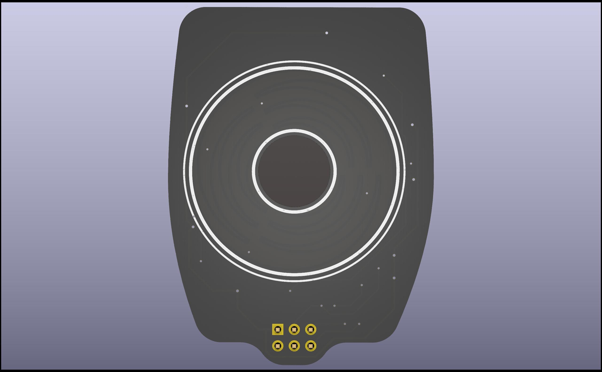
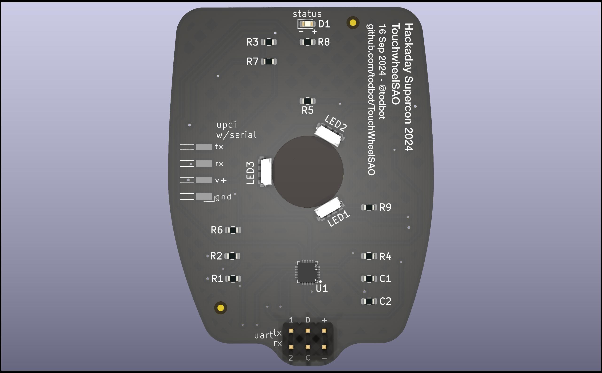
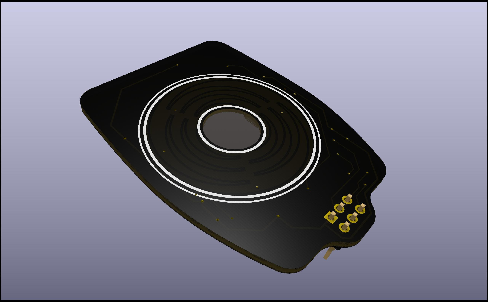
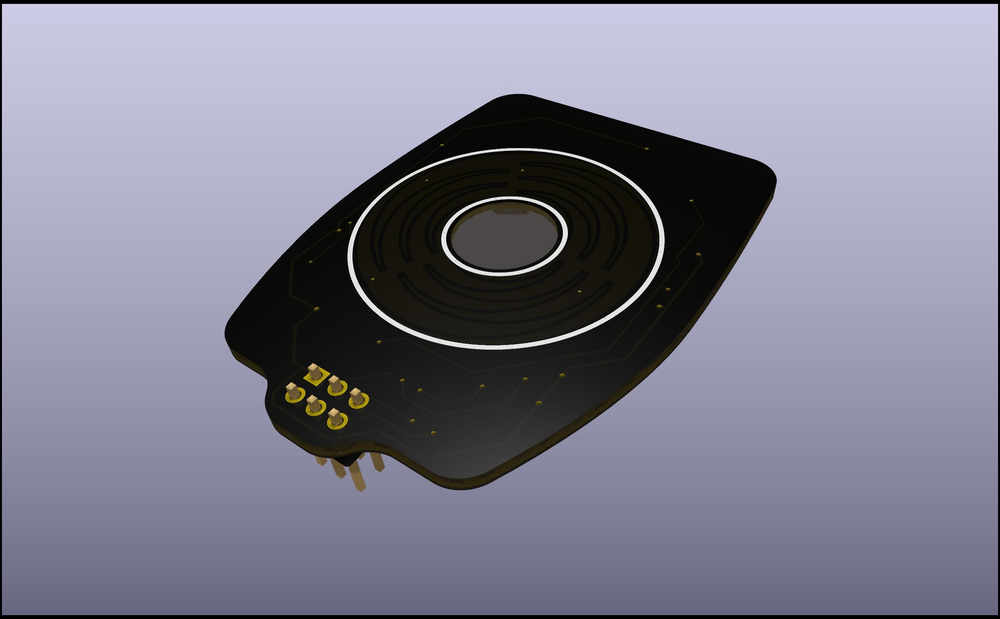
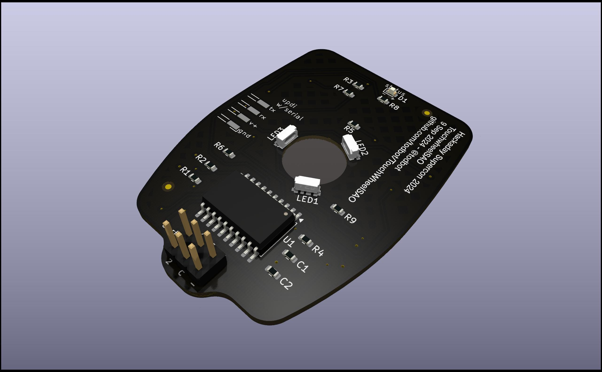

# TouchwheelSAO

Capacitive touchweel SAO for Hackaday Supercon 2024

* [View BOM](https://todbot.github.io/TouchwheelSAO/schematics/TouchwheelSAO/bom/ibom.html)
* [View SCH PDF](https://todbot.github.io/TouchwheelSAO/schematics/TouchwheelSAO/TouchwheelSAO_sch.pdf)
* Production files: [gerbers zip](https://todbot.github.io/TouchwheelSAO/schematics/TouchwheelSAO/production/TouchWheelSAO.zip), [bom csv](https://todbot.github.io/TouchwheelSAO/schematics/TouchwheelSAO/production/bom.csv), [positions csv](https://todbot.github.io/TouchwheelSAO/schematics/TouchwheelSAO/production/positions.csv)

### Renders:

### Prototype Demo: 

https://github.com/user-attachments/assets/b0e4c4f9-f228-49bc-8d6e-ceb53a960fb6

## Prototype Renders

* Render2:

https://github.com/user-attachments/assets/08d6583a-afa1-4c01-aba5-ca108eea4f24

* Render1:

https://github.com/user-attachments/assets/c628ba94-1a07-43ad-b761-b3852f8f35f7

### Notes:

* Related to [touchwheel0](https://github.com/todbot/touchwheels)
* Uses ATtiny816, using [megaTinyCore](https://github.com/SpenceKonde/megaTinyCore) for Arduino
* Originally designed for QFN, but SOIC requested, and ATtiny816 comes in hilariously wide version

