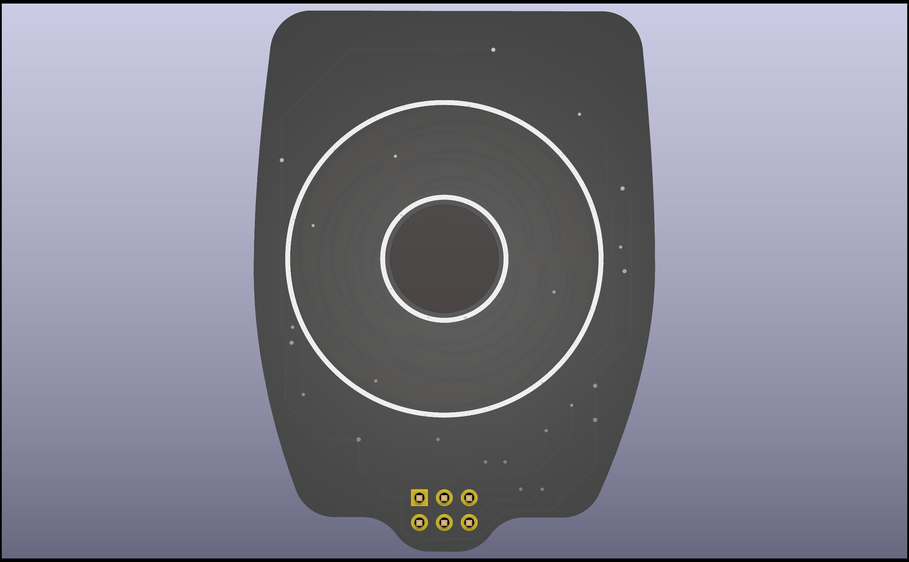
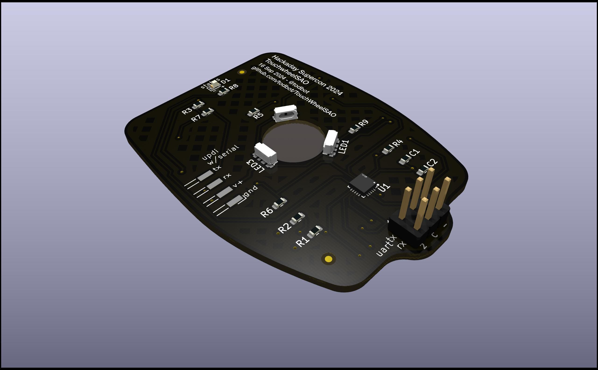
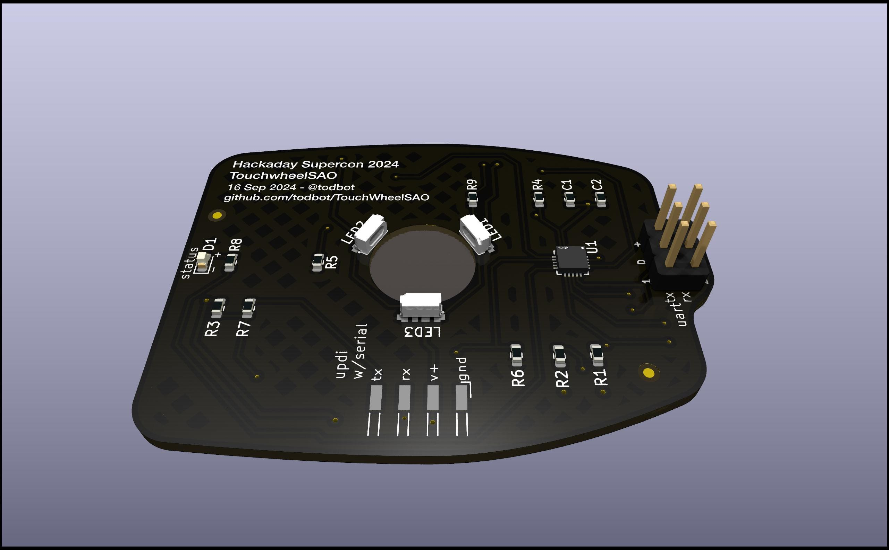

# TouchwheelSAO

Capacitive touchweel SAO for Hackaday Supercon 2024

### Features
- Three capacitive touch pads arranged in interleaved disk, builds on [touchwheel0](https://github.com/todbot/touchwheels)
- Three "Neopixel"-compatible side-light RGB LEDs that shine through the center
- Standard SAO pinout w/ I2C. Spare GPIO lines wired to UART TX/RX
- Finger position 0-255 readable via I2C, LEDs controllable via I2C. See [register map](https://github.com/todbot/TouchwheelSAO/blob/main/firmware/TouchwheelSAO_attiny816/TouchwheelSAO_attiny816.ino#L40) for details
- One status LED on back of board
- ATtiny816-based, same as [seesaw boards](https://learn.adafruit.com/adafruit-attiny817-seesaw)
- Easy compilation using standard Ardiuno toolchain and [megaTinyCore](https://github.com/SpenceKonde/megaTinyCore)
- Uses modified [TouchyTouch](https://github.com/todbot/TouchyTouch) captouch library, included

### Production details

* [View BOM](https://todbot.github.io/TouchwheelSAO/schematics/TouchwheelSAO/bom/ibom.html)
* [View SCH PDF](https://todbot.github.io/TouchwheelSAO/schematics/TouchwheelSAO/TouchwheelSAO_sch.pdf)
* Production files: [gerbers zip](https://todbot.github.io/TouchwheelSAO/schematics/TouchwheelSAO/production/TouchWheelSAO.zip), [bom csv](https://todbot.github.io/TouchwheelSAO/schematics/TouchwheelSAO/production/bom.csv), [positions csv](https://todbot.github.io/TouchwheelSAO/schematics/TouchwheelSAO/production/positions.csv)

### Renders:

### Prototype Demo: 

https://github.com/user-attachments/assets/b0e4c4f9-f228-49bc-8d6e-ceb53a960fb6

## Prototype Renders

* Render2:

https://github.com/user-attachments/assets/08d6583a-afa1-4c01-aba5-ca108eea4f24

* Render1:

https://github.com/user-attachments/assets/c628ba94-1a07-43ad-b761-b3852f8f35f7

### Notes:

* Related to [touchwheel0](https://github.com/todbot/touchwheels)
* Uses ATtiny816, using [megaTinyCore](https://github.com/SpenceKonde/megaTinyCore) for Arduino
* 9Sep2024: Originally designed for QFN, but SOIC requested. ATtiny816 comes in hilariously wide SOIC
* 16Sep2024: Back to QFN for ATtiny816 for JLC assembly.
* 16Sep2024: SAO header must be hand switched to be same side ("top") as SMD in positions.csv for JLC to assemble it correctly

