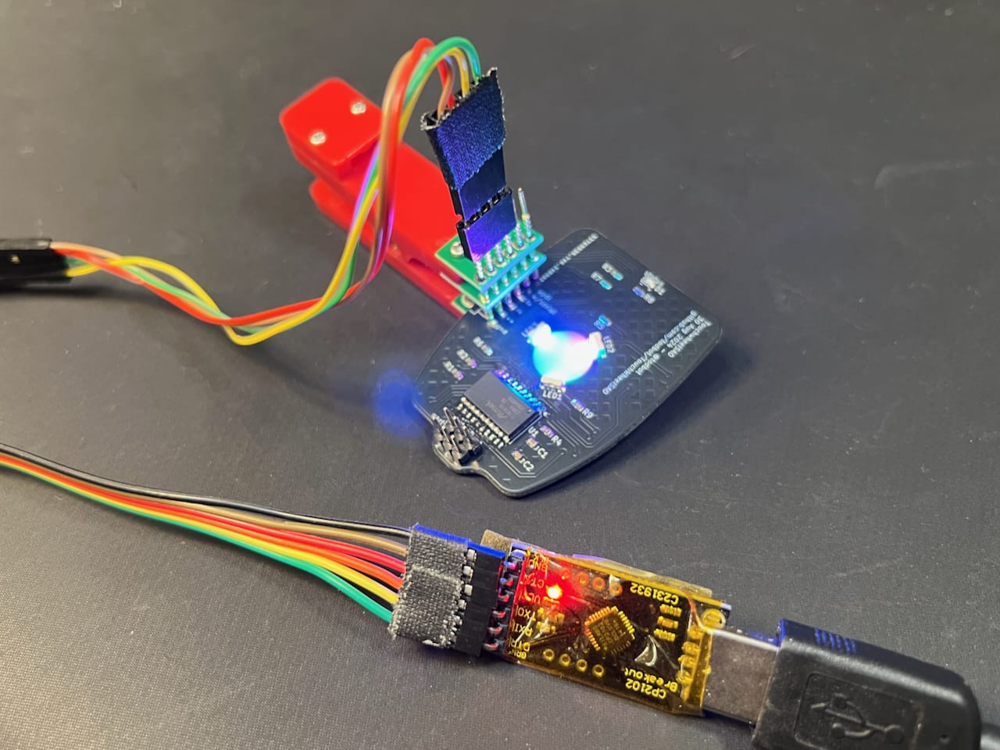

# Installing firmware on TouchwheelSAO board

Use any Windows, MacOS, Linux, RaspberryPi host with USB-to-serial adapter.

## Hardware prep

The TouchwheelSAO board has the UPDI programming port brought out as a 4-pin
SMD header, which a 4-pin pin header can be soldered, or a 4-pin 0.1" spacing
pogo-pin jig clamp can be attached.

The pins on the TouchWheelSAO board are laid out for use with a
[USB-to-serial adapter wired as a UPDI programmer](https://learn.adafruit.com/adafruit-attiny817-seesaw/advanced-reprogramming-with-updi)
but you can also use a standard UPDI programmer too.

Here is what a programmer setup could look like, using:
* [cheap USB-to-serial dongle](https://amzn.to/47sMaxz)
* [Pogo pin probe clip](https://www.digikey.com/short/3c99n5p9)

<a href="./firmware-programming1.jpg"></a>


## Software, Compiling, Uploading

Instead of installing the Arduino GUI, we can use [arduino-cli](https://arduino.github.io/arduino-cli/1.0/)

### Install arduino-cli

```sh
curl -fsSL https://raw.githubusercontent.com/arduino/arduino-cli/master/install.sh | sh
```

### Install megatinycore 

```sh
arduino-cli core install megatinycore:megaavr  --additional-urls https://drazzy.com/package_drazzy.com_index.json
 ```

### (optional) Show some details on the core:

```sh
arduino-cli board details -b megaTinyCore:megaavr:atxy6
```


### Compile:

```sh
arduino-cli compile --verbose --fqbn megaTinyCore:megaavr:atxy6:chip=816,printf=minimal \
            --build-path=$(pwd)/build TouchwheelSAO_attiny816
```


### Upload

```sh
arduino-cli upload --verbose --fqbn megaTinyCore:megaavr:atxy6:chip=816  \
            --port /dev/ttyUSB0 --programmer serialupdi57k  \
            --input-dir ./build

```

### Shell script for batch programming

Also see firmware/batch-program.sh

```sh
#!/bin/bash

PORT=/dev/ttyUSB0
HEX_FILE=./build/TouchwheelSAO_attiny816.ino.hex

while [ 1 ] ; do
  read -rsn1 -p"Press any key program firmware"; echo
  arduino-cli upload --verbose --fqbn megaTinyCore:megaavr:atxy6:chip=816  \
              --port $PORT --programmer serialupdi57k  \
              --input-file=$HEX_FILE
  echo "--------------------"
done

```